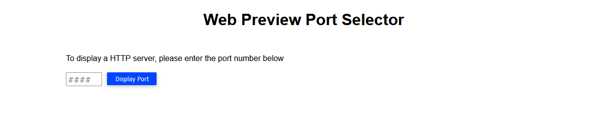
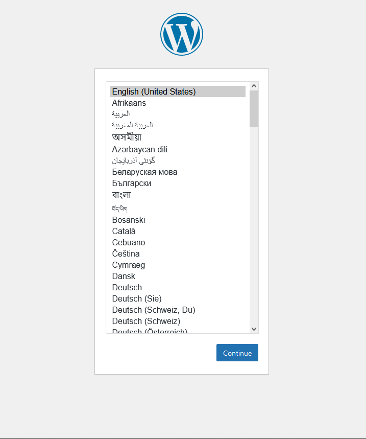

#Accessing the database:

Now that you have setup the server and database, the website could be accessed via your browser, and database could be accessed using the terminal on the right!

Accessing website

https://[[HOST_SUBDOMAIN]]-[[KATACODA_HOST]].environments.katacoda.com/

Using the generated url for this scenario above, you should see a page like this:

Woocommerce store is based on wordpress, to access the wordpress site, enter port 20080, and press display port:

If you see a page like this:

Success! You have set up your own wordpress site!

If you keep on using the site, it will lead you through the proccess of setting it up, this is not this course's main focus though, so you may close the site and continue.

