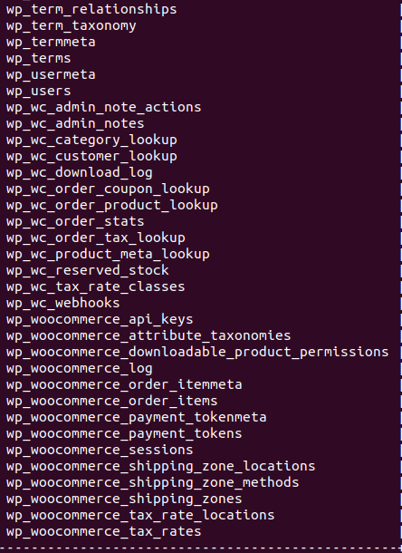

# Using the database

Now we can show the databases in this server using the following command:

`SHOW DATABASES;`{{execute}}

You should see a list of databases, including the wordpress database we are going to use.

Now, we connect to our database using the command:

`use wordpress;`{{execute}}

Now you are in the database!

In this demo, a list of tables is created to simulate what we might have in a database while hosting a woocommerce store, use the following command to list out the tables:

`Show tables;`{{execute}}

while there is a lot more different tables in a actual woocommerce environment, similar to the picture below:

In order for you to easier familiarize yourself to the environment, this simplified version of database will be used across the scenarios.
