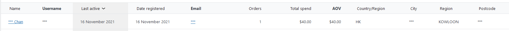

The sensitive user’s personal identifiable information will show on the database and the dashboard. Those personal identifiers are the asset.We should hide that on the database and the dashboard of Wordpress/ WooCommerce platform.Therefore,you can follow those steps to prevent the personal identifiers leak. 

(Please install Woocommerce before execute the command)

First,we need to backup the table of wp_wc_customer_lookup,this table collect the data of the information about the customer. We need to backup those information and do following step. 

`mysqldump -u root -p12345 wordpress wp_wc_customer_lookup > wp_wc_customer_backup.sql`{{execute}} 

 We can check the backup is or is not correct export to the directory.Using ls command to check the directory exist the backup file or not.

 `ls`{{execute}}

After backup the information is backup,we need to do change all the personal identifiable information become *** on the database so that the personal identifiers will hide.

`update wp_wc_customer_lookup set username = '***',email='***',first_name='***',postcode='***',city='***'  where username LIKE "%%";`{{execute}}

You can this this sql query to check the table.

`select * from wp_wc_customer_lookup;`{{execute}}

And the dashboard of the Wordpress/ WooCommerce platform will show *** of the information of the user.

