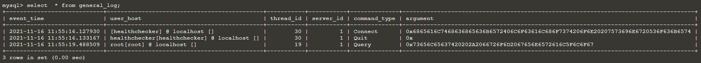
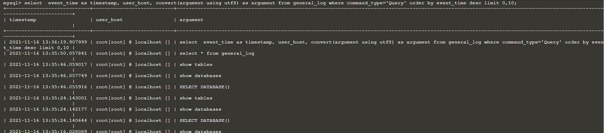

# Mysql general log enable

As acttacker may try to access our database. Therefore, We should audit log with users in the database. 

Therefore,you can follow those steps to active the audit log to record the event for users in the database.

You can use the follow command to enable the general log in the database.

`SET global general_log = 1;`{{execute}}
 
log_output system variable specifies the destination for log output. We can choose value from TABLE or FILE. Here we will use the table to display the general log. The follow command is used to choose table for the general log;

`SET global log_output = 'table';`{{execute}} 

You can use `select * from general_log;`{{execute}} to show the events with users in the database.

You also can use `select  event_time as timestamp, user_host, convert(argument using utf8) as argument from general_log where command_type='Query' order by event_time desc limit 0,10;`{{execute}} to show the most recent 10 SQL statements executed by users in the database.

