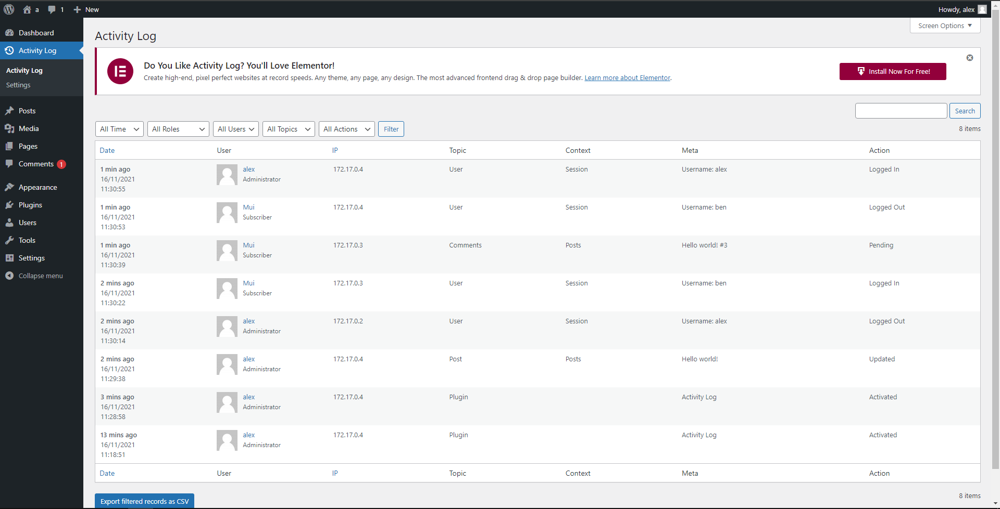
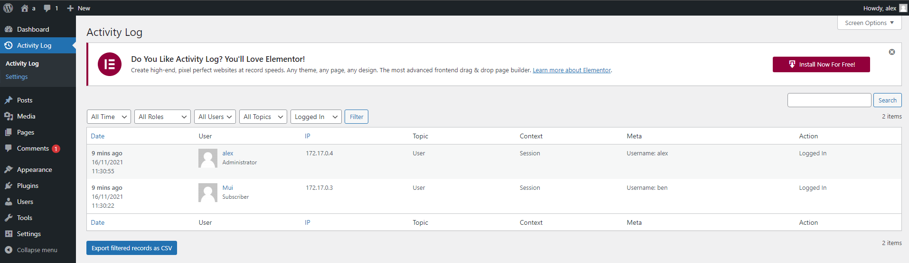

# wordpress audit log plugins

In wordpress, we will face some external and internal attacks. There we need to audit log in the wordpress.
Here we will talk about how to enable the audit log in wrdpress.

Accessing website by 20080 port.
https://[[HOST_SUBDOMAIN]]-[[KATACODA_HOST]].environments.katacoda.com/

we access the wordpress website and select the plugins. 

Please enter log in the search box to find a suitable audit log for your database. 

Here we will select the Activity Log to demo the process of the audit log. we need to click the install now button in the top right corner.

After we install the activity log, we also need to activate it.

if the activity log is activated, we can see the activity log in our plugins page.

we can click the activity log page and view the events in the database. we also can filter the events by time, roles, user, topics, actions.  

*More details on https://www.youtube.com/watch?v=57wm56bSH9o
