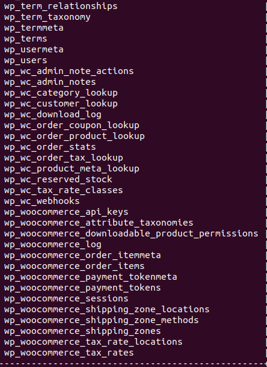

# Using the database

In this demo, a list of tables is created to simulate what we might have in a database while hosting a woocommerce store, use the following command to list out the tables:

`Show tables;`{{execute}}

These tables includes the store's customer data, staff data, goods data and so on.

Of course, you could also use any sql statements in the terminal here for more information.

while there is a lot more different tables in a actual woocommerce environment, similar to the picture below:

In order for you to easier familiarize yourself to the environment, this simplified version of database will be used across the scenarios.
